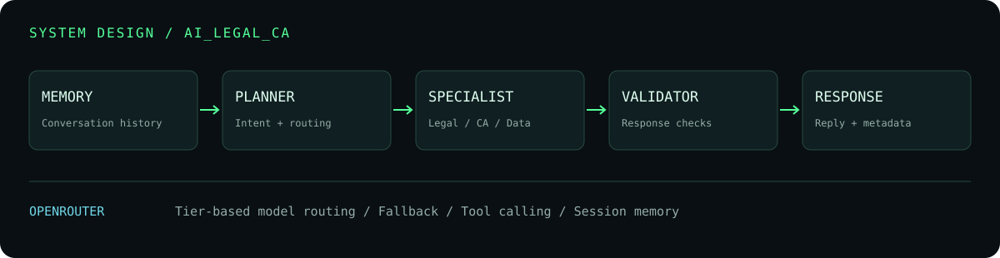

### Full Stack Developer & AI Engineer

**Interfaces that feel good. Backends that connect them. AI that takes action.**

[Projects](#selected-builds) &nbsp; / &nbsp; [Tech stack](#engineering-stack) &nbsp; / &nbsp; [AI architecture](#inside-the-ai-system) &nbsp; / &nbsp; [GitHub](https://github.com/choudhary-lokeshh?tab=repositories)

---

### Beyond the interface

I'm **Lokesh Choudhary**, a **Full Stack Developer & AI Engineer** building across frontend, backend, databases and AI integrations. My projects span React and Next.js interfaces, Node.js services, TypeScript applications and agent-based workflows.

- **Full stack:** web interfaces, REST APIs, authentication and database-backed applications.
- **AI engineering:** specialist agents, prompt design, tool calling, model routing and conversational memory.
- **Across platforms:** web, admin and creator interfaces, plus React Native / Expo mobile development.

### Engineering stack

**FRONTEND**

**BACKEND**

**DATA & JOBS**

**AI ENGINEERING**

### Inside the AI system

My **[AI_Legal_CA](https://github.com/choudhary-lokeshh/AI_Legal_CA)** project coordinates a planner, specialist agents and a response validator. Its LLM router selects model tiers and falls back to another model when a request fails.

<b>Under the hood →</b>

- **Orchestration:** planner routes requests to legal, CA or data agents.
- **Context:** session history is loaded before execution and saved afterward.
- **Model routing:** agent-specific tiers, primary/fallback models and token settings.
- **Tool interface:** tool definitions are passed to the model using automatic tool selection.
- **Validation:** responses pass through a validator before returning reply metadata.
- **SDK dependencies:** OpenAI, Google Generative AI and Groq are also present in the backend manifest; the inspected router uses OpenRouter.

### Selected builds

<table>
<tr>
<td width="50%" valign="top">
<h3>01 / AI_Legal_CA</h3>

Agent orchestration for legal, CA and data workflows, with conversation history, model fallback and response validation.

<code>React</code> <code>Express</code> <code>MongoDB</code> <code>OpenRouter</code>

<a href="https://github.com/choudhary-lokeshh/AI_Legal_CA"><b>Explore AI system ↗</b></a>
</td>
<td width="50%" valign="top">
<h3>02 / VELORA</h3>

TypeScript monorepo spanning web, admin, creator studio, mobile and API applications.

<code>Next.js</code> <code>Expo</code> <code>Bun / Elysia</code> <code>Drizzle</code>

<a href="https://github.com/choudhary-lokeshh/VELORA"><b>Explore platform ↗</b></a>
</td>
</tr>
<tr>
<td width="50%" valign="top">
<h3>03 / IShop</h3>

Full-stack project with separate frontend and backend directories, an Express backend and Mongoose dependencies.

<code>JavaScript</code> <code>Node.js</code> <code>Express</code> <code>MongoDB</code>

<a href="https://github.com/choudhary-lokeshh/Full-Stack-Ishop-project"><b>Explore repository ↗</b></a>
</td>
<td width="50%" valign="top">
<h3>04 / OrayTech</h3>

Marketing website combining a React / Next.js foundation with Tailwind styling and Framer Motion.

<code>Next.js</code> <code>React</code> <code>Tailwind CSS</code> <code>Motion</code>

<a href="https://github.com/choudhary-lokeshh/oraytech-website"><b>Explore website code ↗</b></a>
</td>
</tr>
</table>

<a href="https://github.com/choudhary-lokeshh?tab=repositories"><b>Browse all repositories →</b></a>

---

**`BUILD THE INTERFACE. ENGINEER THE SYSTEM. CONNECT THE INTELLIGENCE.`**

Lokesh Choudhary · Full Stack Developer & AI Engineer

