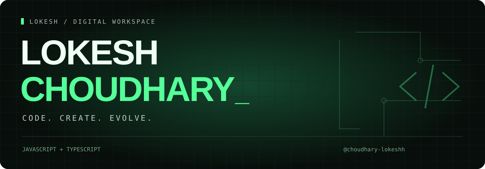

<p align="center">
  
</p>

<div align="center">


[Explore my code](https://github.com/choudhary-lokeshh?tab=repositories) &nbsp; · &nbsp; [Recent activity](https://github.com/choudhary-lokeshh?tab=overview)

</div>

<br>

### ⌁ &nbsp; THE DEVELOPER

I'm **Lokesh**, and this is my corner of GitHub. My repositories explore web applications and interfaces with **JavaScript, TypeScript, Next.js, Tailwind CSS and Framer Motion**.

```js
const lokesh = {
  workspace: "Web applications",
  languages: ["JavaScript", "TypeScript"],
  approach: "Create → Test → Refine",
};
```

<br>

### ⌁ &nbsp; THE TOOLKIT

<p>


</p>

<br>

### ⌁ &nbsp; SELECTED WORK

<table>
<tr>
<td width="50%" valign="top">
<h3>01 / OrayTech</h3>
<p>Marketing website built with Next.js, Tailwind CSS and Framer Motion.</p>
<a href="https://github.com/choudhary-lokeshh/oraytech-website">Explore repository ↗</a>
</td>
<td width="50%" valign="top">
<h3>02 / IShop</h3>
<p>A full-stack project with separate frontend and backend codebases.</p>
<a href="https://github.com/choudhary-lokeshh/Full-Stack-Ishop-project">Explore repository ↗</a>
</td>
</tr>
<tr>
<td width="50%" valign="top">
<h3>03 / AI_Legal_CA</h3>
<p>A JavaScript repository with frontend and backend code.</p>
<a href="https://github.com/choudhary-lokeshh/AI_Legal_CA">Explore repository ↗</a>
</td>
<td width="50%" valign="top">
<h3>04 / VELORA</h3>
<p>Explore the code in my TypeScript repository.</p>
<a href="https://github.com/choudhary-lokeshh/VELORA">Explore repository ↗</a>
</td>
</tr>
</table>

<br>

<div align="center">

**`LESS TALK. MORE COMMITS.`**

<sub>Thanks for stopping by. Take a look around the repositories.</sub>

</div>
